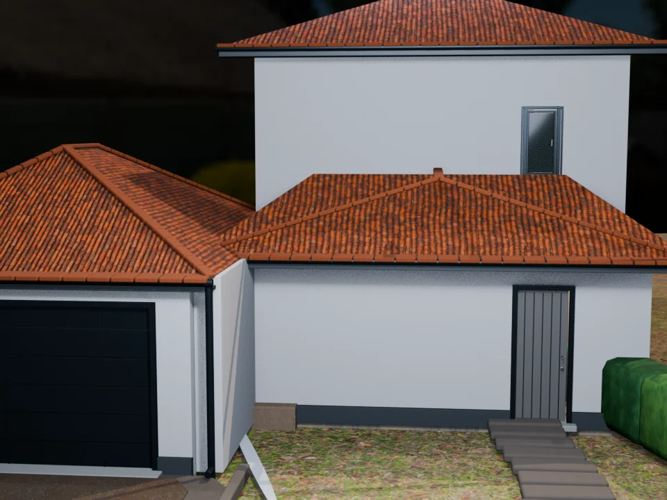
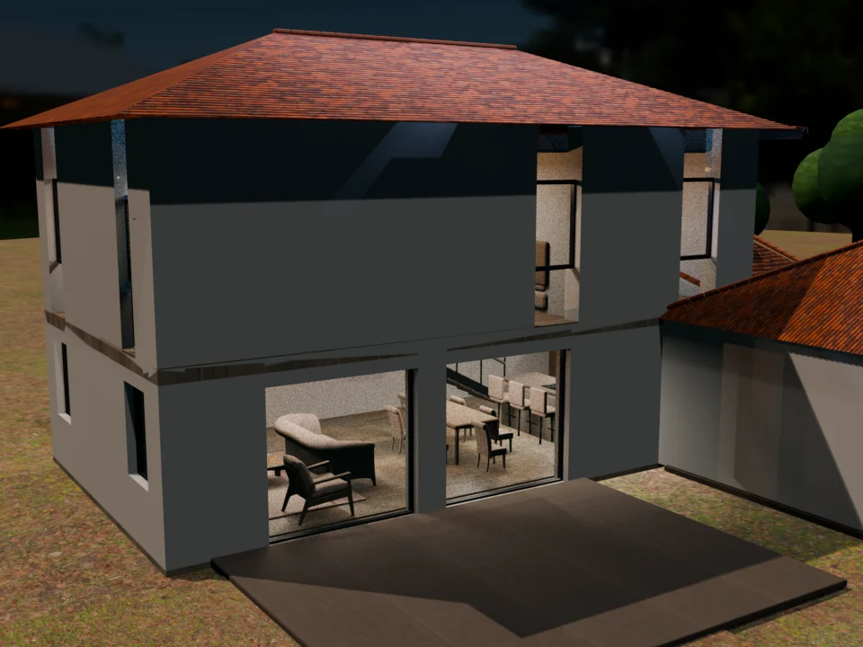

# Maison de Chamagnieu — V18

Ce dépôt public présente la maison neuve de Chamagnieu dans un format directement lisible par GPT : description textuelle, images intégrées, données JSON et modèle 3D.

## Voir la maison

[**Ouvrir la page propre de la maison**](https://ramanaru.github.io/chamagnieu/) · [Commencer dehors et entrer](https://ramanaru.github.io/chamagnieu/visite/) · [Présentation 3D](https://ramanaru.github.io/chamagnieu/presentation/) · [Dépôt GitHub lisible par GPT](https://github.com/ramanaru/chamagnieu)

### Façade, toiture complète et sols extérieurs

### Jardin, textures et façade arrière

## Ce qui est visible dans cette version

- Trois volumes de toiture fermés avec des tuiles terre cuite texturées.
- Des sols extérieurs différenciés : pelouse, enrobé et gravier.
- Quatre arbres et dix-huit éléments de haie dans l'environnement.
- La table extérieure parasite a été supprimée.
- La visite interactive commence à l'extérieur et permet d'entrer dans la maison.

## Fichiers directs pour GPT

- [Description structurée `house.json`](house.json)
- [Image façade/toiture brute](https://raw.githubusercontent.com/ramanaru/chamagnieu/main/images/v18-facade-roof-ground.webp)
- [Image jardin/textures brute](https://raw.githubusercontent.com/ramanaru/chamagnieu/main/images/v18-jardin-textures.webp)
- [Modèle 3D GLB réellement chargé](https://raw.githubusercontent.com/ramanaru/chamagnieu/main/shared/Chamagnieu_V18_REALISM_FINAL.glb)
- [Configuration centrale du viewer](shared/project-config.json)
- [Audit de synchronisation V18](audit/version-sync-report.md)
- [Verdict live V18](validation/V18_LIVE_SYNC_REPORT.md)

Version : `V18-LIVE-SYNC-3` 
Modèle GLB : `27 987 896 octets` 
SHA-256 : `79A0F908DCCA94ADE328A46247D51118BDEB51CE1217DE567E2040DB05D58C28`

## Sources visuelles

- Les pages `/presentation/` et `/visite/` affichent le modèle Web et portent le badge **`SOURCE = LIVE WEB VIEWER`**.
- Les images de cette page et de `/rapide/` sont des rendus de référence et portent le badge **`SOURCE = BLENDER`** dans le site.
- Les deux sources restent volontairement séparées : les WebP de galerie ne sont pas des textures du GLB.
