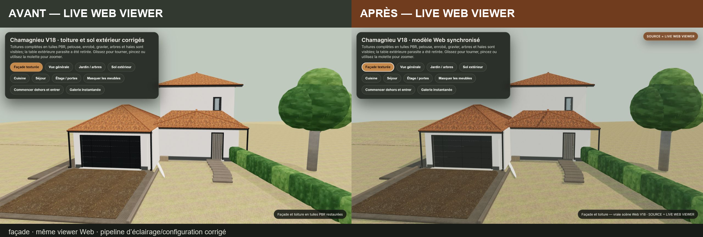
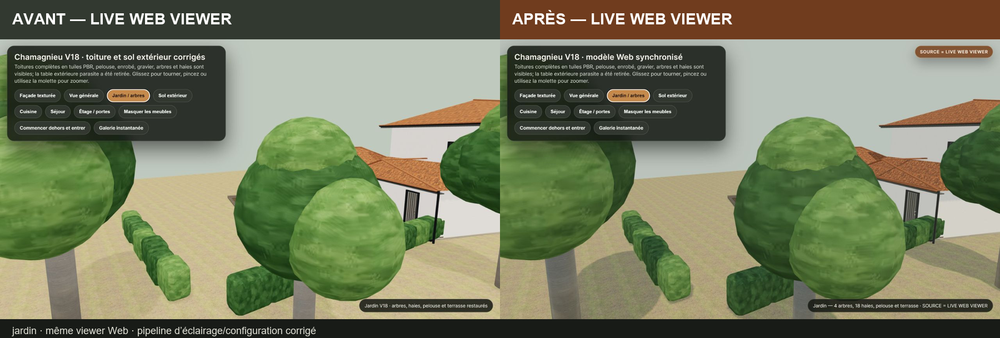
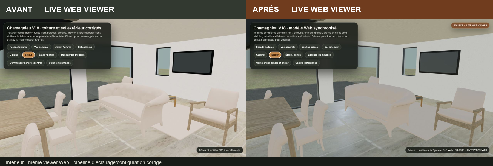
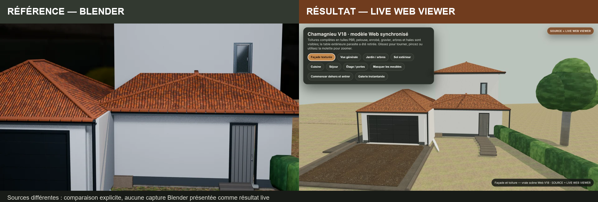
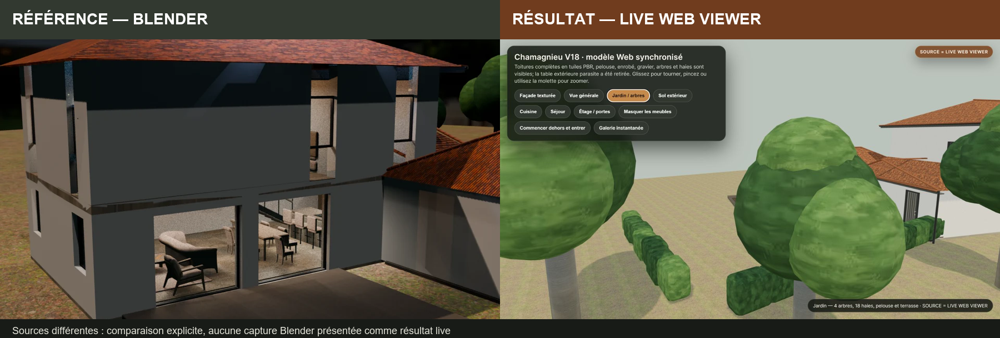
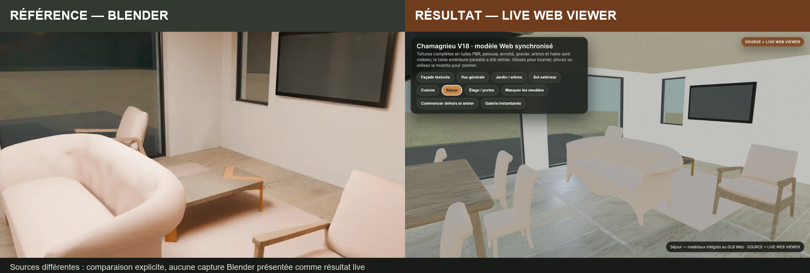

# Comparaison présentation, références Blender et rendu live

## Statut

**`PARTIAL`** : la synchronisation technique du viewer est validée localement, la provenance est maintenant explicite et l’éclairage Web est amélioré. Le résultat live reste visiblement moins réaliste que les références Blender/D5.

## Deux comparaisons différentes

### 1. Avant / après — même `LIVE WEB VIEWER`

Les montages `compare-before-after-*` comparent la même scène Three.js et les mêmes cadrages avant/après la centralisation du pipeline. Ils isolent surtout l’effet de l’IBL PMREM, d’ACES, de l’exposition abaissée, des ombres desktop et de l’anisotropie.







### 2. Référence / résultat — sources volontairement différentes

Les montages `reference-vs-live-*` ne prétendent pas être des captures du même moteur. La moitié gauche est étiquetée **`RÉFÉRENCE — BLENDER`** ; la moitié droite est étiquetée **`RÉSULTAT — LIVE WEB VIEWER`**.







## Résultats par vue

| Vue | Correction réellement obtenue | Différence encore visible | Cause exacte dominante |
|---|---|---|---|
| Façade | toit/sol plus contrastés, ombres et filtrage oblique améliorés, modèle/release sourcés | tuiles moins profondes, fond et enduits plus plats, géométrie générale plus simple | PMREM procédurale au lieu d’une HDRI/D5 ; pans de toit à 6 triangles ; pas d’AO |
| Jardin | ombres au sol, verts un peu moins délavés, quatre arbres et dix-huit haies confirmés | canopées rondes, haies en blocs, faible micro-détail botanique | végétation low-poly ; deux JPEG 256² base-color-only sans alpha/normal/roughness |
| Intérieur | exposition réduite, sol et bois plus lisibles, pipeline identique à la visite | canapé/chaises très pâles, contacts faibles, mobilier parfois procédural | 15/35 matériaux sans texture ; aucune AO/emissive ; lumières intérieures Blender non reproduites ; topologie simplifiée |

## Provenance des fichiers

| Fichier ou page | Provenance à lire |
|---|---|
| `before-facade.png`, `before-jardin.png`, `before-interieur.png` | ancienne capture `LIVE WEB VIEWER` |
| `after-facade.png`, `after-jardin.png`, `after-interieur.png` | capture locale `LIVE WEB VIEWER`, release `V18-LIVE-SYNC-3` |
| `compare-before-after-*.png` | live Web avant à gauche, live Web après à droite |
| `reference-vs-live-*.png` | référence Blender à gauche, vrai viewer Web à droite |
| `/` et `/rapide/` | images statiques, badges `SOURCE = BLENDER` |
| `/presentation/` et `/visite/` | canvas interactif, badge `SOURCE = LIVE WEB VIEWER` |

Les images WebP de la galerie sont des rendus pré-calculés. Elles ne sont pas référencées par le JSON glTF et ne constituent pas les textures appliquées à la maison. Le GLB contient ses propres 37 JPEG embarqués.

## Preuves runtime associées

- `../../validation/live-browser-validation.json` : cinq routes testées, titres/sources/version/modèle observés.
- `../browser-console.txt` : URLs chargées, runtime avant et section `MODIFIED FINAL`.
- `../network-errors.txt` : contrôles réseau avant et final.
- `../live-lighting.md` : réglages d’éclairage, couverture matérielle et limites.
- `../texture-path-report.md` : inventaire des 37 images intégrées et absence de chemins texture externes.
- `../live-materials.md` : 35 matériaux, 501 liaisons texturées et géométrie des assets.

## Verdict honnête

```text
VERSION_AND_MODEL_SYNC=PASS_LOCAL
PRESENTATION_AND_VISITE_PIPELINE_SYNC=PASS_LOCAL
SOURCE_PROVENANCE_LABELS=PASS
TEXTURE_DELIVERY=PASS_LOCAL
LIVE_VISUAL_IMPROVEMENT=YES
LIVE_MATCHES_BLENDER_D5=NO
PUBLIC_RUNTIME_VERIFIED=NO
FINAL_STATUS=PARTIAL
```

Le viewer affiche désormais ce qu’il charge réellement et les comparaisons ne présentent plus un rendu Blender comme résultat live. La prochaine amélioration photoréaliste exige des changements d’assets et de rendu — HDRI réelle, AO, matériaux supplémentaires, végétation et géométrie plus détaillées — et non un simple changement de lien ou de cache.
