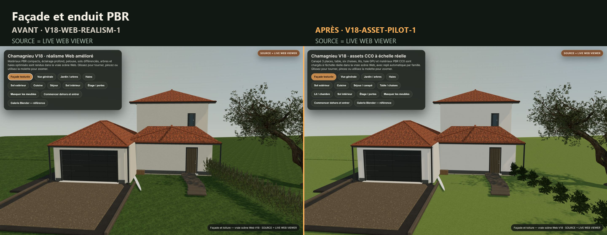
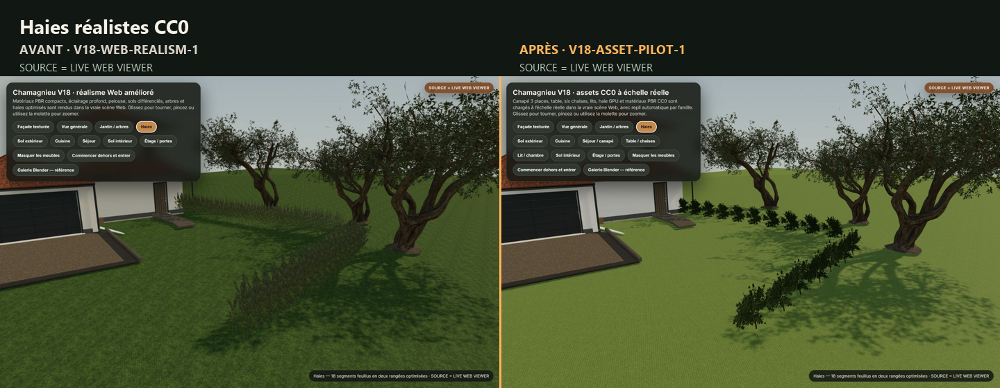
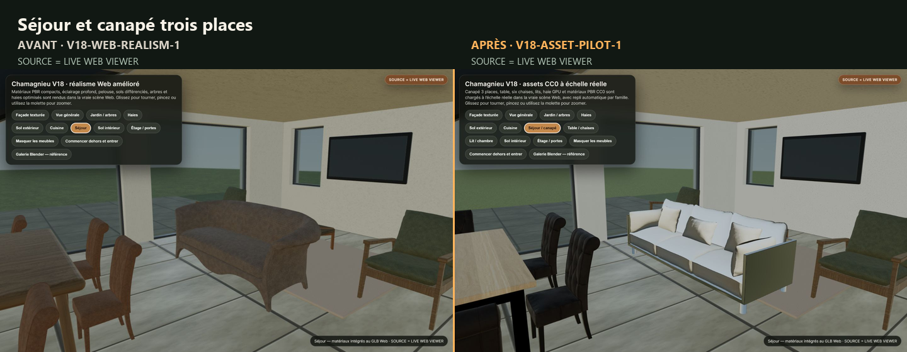
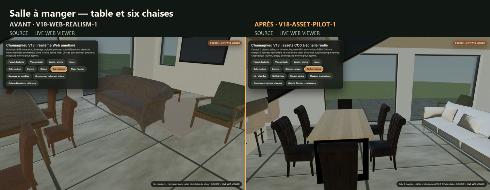
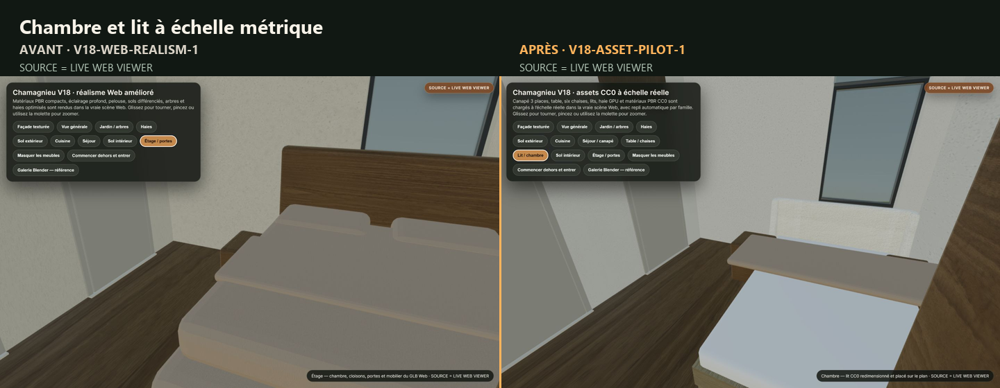
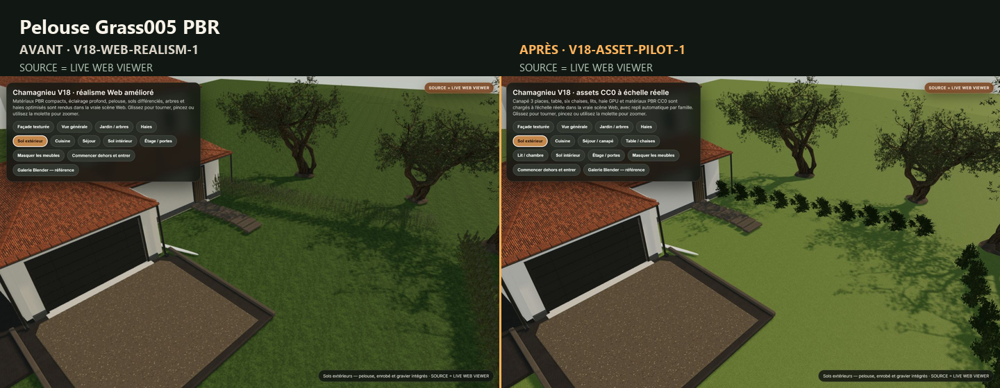
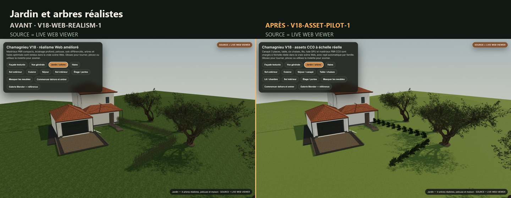

# Comparaisons du pilote d’assets V18

`SOURCE = LIVE WEB VIEWER` pour les deux colonnes. Les vues « avant » proviennent de la release `V18-WEB-REALISM-1`; les vues « après » de `V18-ASSET-PILOT-1`. Les images Blender sont conservées séparément sous `../blender/`.

## Façade et enduit PBR

`684695 octets` · `SHA-256 596D71C0A61E6E5A229467E03621EF003C4EC27A9842F69AC9D9C079B8FD715E`

## Haies réalistes CC0

`865596 octets` · `SHA-256 5A7B5076B1C901AE525D8A97F7975A81C60CD121AA5115070960D7B42E91B262`

## Séjour et canapé trois places

`555463 octets` · `SHA-256 F96CEB823014B10094B7483C4620BD2E2C693FC8C612C60EAE735AB16A116C8F`

## Salle à manger — table et six chaises

`567213 octets` · `SHA-256 757421318ACDACEAEA34C9079D643C6CD12F91AC3A40435899ACEE622FCC6EFB`

## Chambre et lit à échelle métrique

`439568 octets` · `SHA-256 4B41B0DEFD0A4ACDB9928F2104AD217A4EA30130372E67901991AAE30CF40841`

## Pelouse Grass005 PBR

`917739 octets` · `SHA-256 54E9C2E624352371492A0746B9DCEBC7772ADBD68F226A55D463CC9D94B4AC2C`

## Jardin et arbres réalistes

`645295 octets` · `SHA-256 2F5EB0225D830B21FFBCF0D1D120B5A450235E81FA42A7EAE0A438B9E1D92914`
