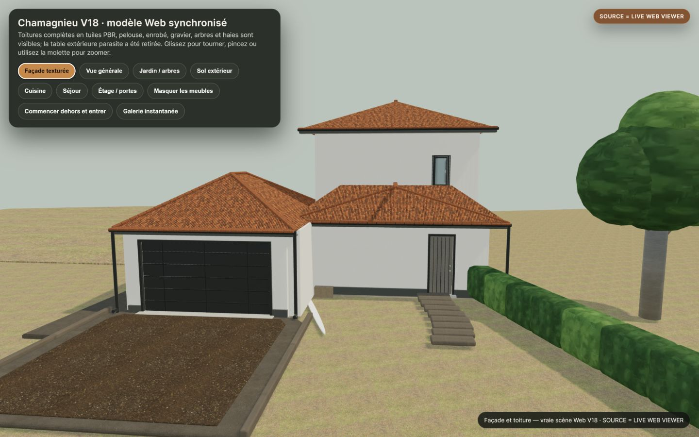
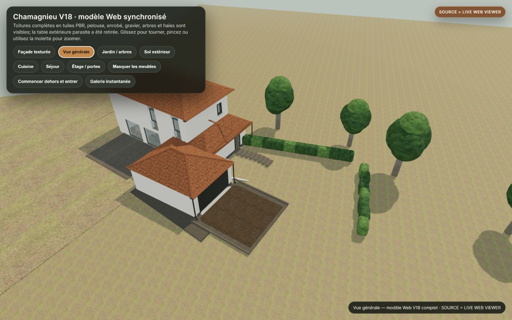
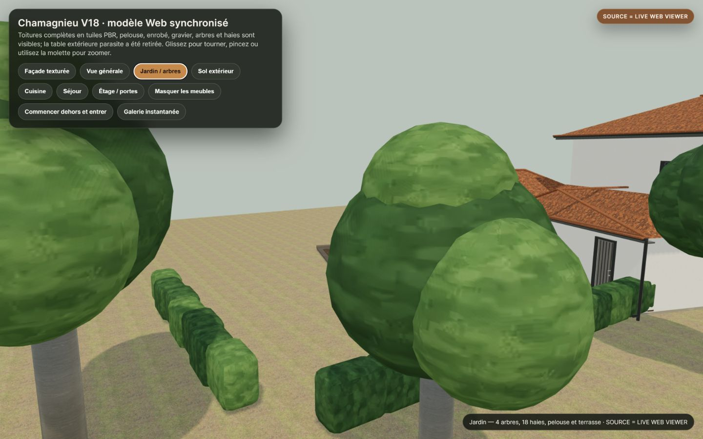
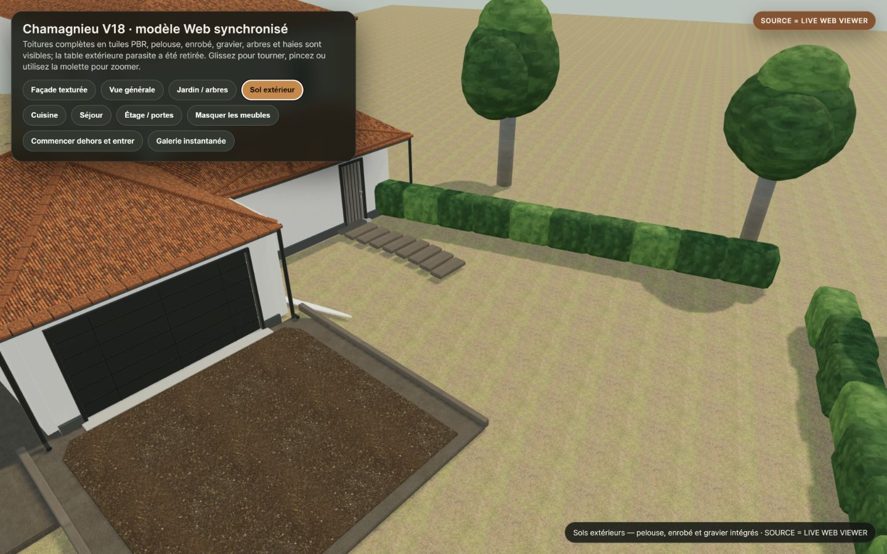
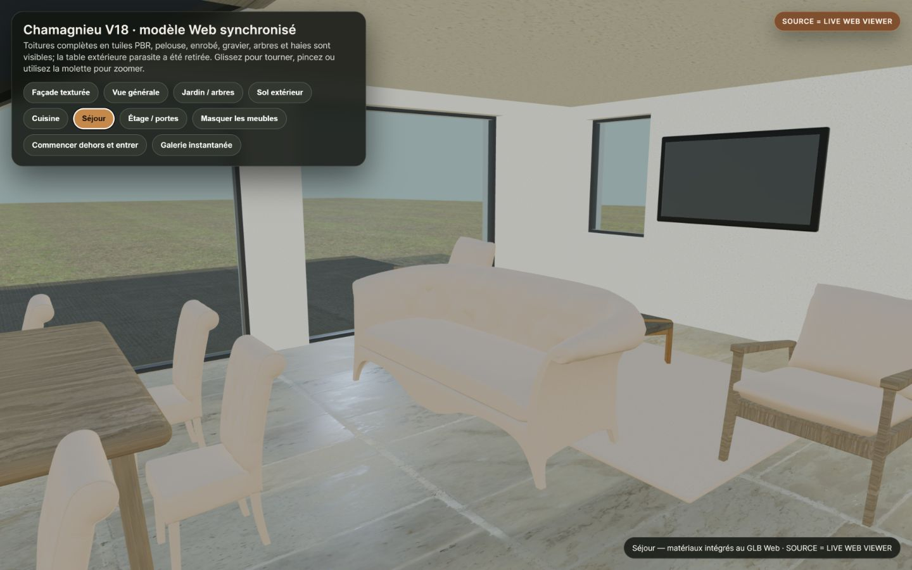
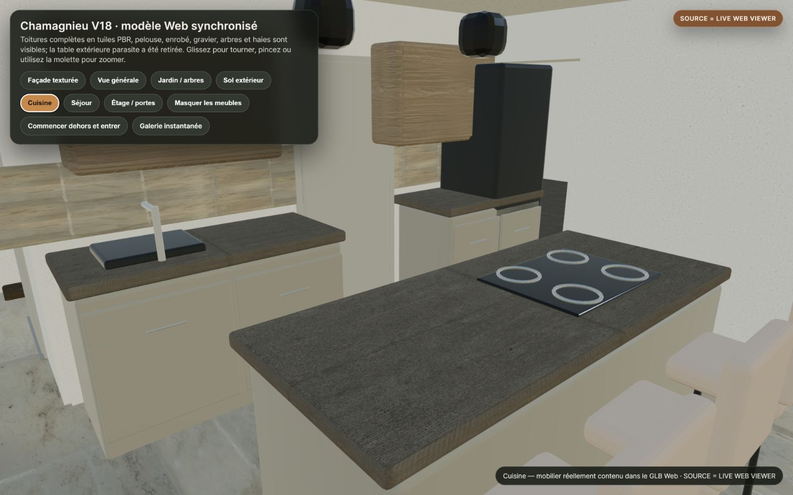
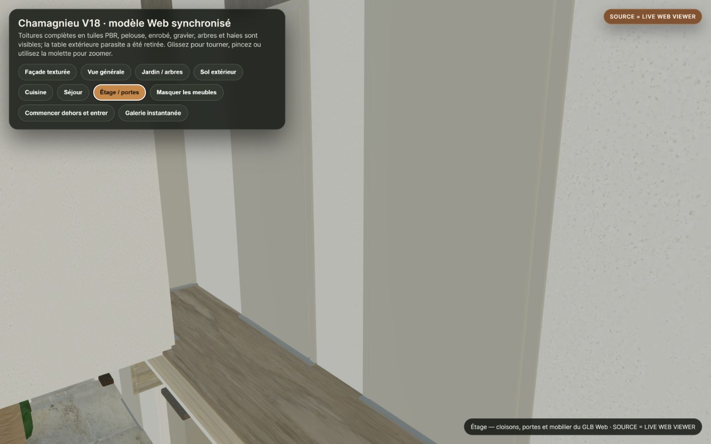
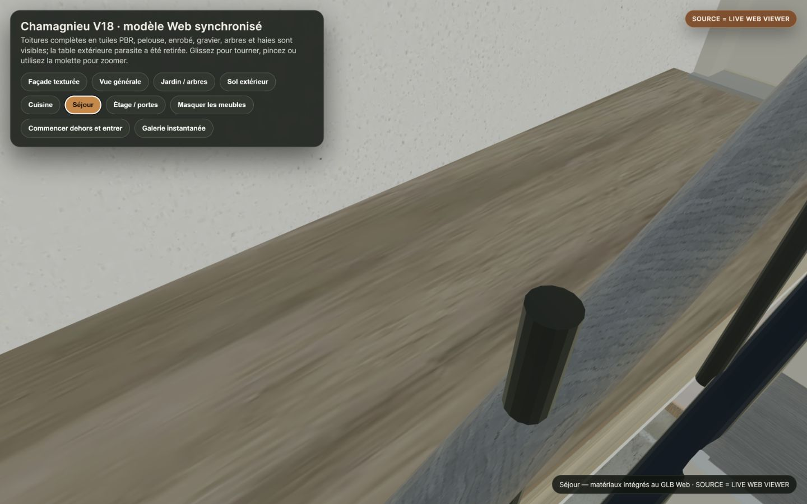

# Baseline public V18 Sync-4 — SOURCE = LIVE WEB VIEWER

## Périmètre vérifié

- **URL publique capturée :** <https://ramanaru.github.io/chamagnieu/presentation/?release=v18-live-sync-4&baseline=20260816>
- **Source :** `LIVE WEB VIEWER`
- **Navigateur :** Codex In-app Browser uniquement
- **Viewport imposé et conservé :** `1440 × 900 CSS px`
- **Encodage des captures :** JPEG/JFIF tel que retourné par l’API de capture du navigateur intégré
- **Version :** `V18`
- **Release :** `V18-LIVE-SYNC-4`
- **Cache key :** `v18-live-sync-4`
- **Modèle :** `Chamagnieu_V18_REALISM_FINAL_WEBP.glb`
- **Modèle bytes :** `25169320`
- **Modèle SHA-256 :** `69F10EC076B68968CA91F0412481956F5CE0E1DE972ECB5E25CBF69990306DDE`
- **Date UTC :** `2026-08-16T09:54:23.813Z`
- **Résultat baseline :** `PASS`

Les captures sont celles de la vraie page publique. Elles ne proviennent ni de Blender, ni de la galerie statique, ni d’un navigateur Playwright autonome.

## Audit navigateur public

| Contrôle | Résultat |
|---|---:|
| Viewer ready | PASS |
| WebGL2 | PASS |
| Réponses réseau | 51/51 HTTP 200 |
| Ressources HTTP(S) | 14 |
| Images WebP blob décodées | 37 |
| Chargements échoués | 0 |
| Réponses non-2xx | 0 |
| Erreurs console | 0 |
| Avertissements console | 0 |
| Images DOM cassées | 0 |
| Service workers enregistrés | 0 |
| CacheStorage | 0 |

Le détail machine-lisible est dans [baseline-browser-audit.json](baseline-browser-audit.json).

## Caméras et captures reproductibles

Les positions `p` et cibles `t` ci-dessous ont été lues dans le script JavaScript réellement servi par l’URL publique au moment de la capture.

| Vue | Caméra p | Cible t | Dimensions | Octets | SHA-256 |
|---|---|---|---:|---:|---|
| facade | `1.941, 4.4, -15.173` | `-1.436, 2.655, -0.663` | 1440×900 | 143088 | `6E514D1BC23DBCB7D733E1178D2F34BFB7AC17DA62C27B5E7D4ED3AE4CAC3B05` |
| general | `22.008, 21.5, -10.53` | `-0.75, 2.1, -4.5` | 1440×900 | 160704 | `F1C6A078500B878523759B89DF0710154F4A0DCC6E1FA82EE25C63B3E0E467CB` |
| garden | `-12.5, 5.3, -17.2` | `-4.2, 3.7, -11.86` | 1440×900 | 123061 | `D81BFA259EEE1A94AFB73555A37AEF0CD13AE2ACC98DE7D0E85AF4CC2FFEE31D` |
| exterior-ground | `9.5, 8.2, -10.5` | `-2.4, 0.15, -5.4` | 1440×900 | 188473 | `B0B286E43AF6AE786E731230421F802E1D6F3D1CD4CD5329DF4FAB9677AAEEDB` |
| living | `-7.465, 1.58, 5.19` | `-5.459, 0.92, 8.133` | 1440×900 | 102036 | `E807A384A3EBFD86448DAFCD7DB425F7DF9BB74A12A784B764BB5C594EEB49BA` |
| kitchen | `-5.875, 1.82, 4.353` | `-3.439, 0.92, 2.852` | 1440×900 | 114226 | `A4DBCE5BDEB2601023C899148D33418370EF3233025964ABCD39A6B8929A32F5` |
| upstairs-doors | `-7.65, 4.12, 5.74` | `-5.819, 3.62, 4.689` | 1440×900 | 77602 | `3ACA2D6108E6EC0D887BBAE9B304C0431BF742CFE9C0E8E78F71C52FD5007816` |
| interior-floor/materials | `-7.465, 1.58, 5.19` | `-5.459, 0.92, 8.133` | 1440×900 | 101995 | `84E602B41B52BB3797AEA24BF92F434479FDC6A859D1E063DEC73D5EF4D48BE3` |

### Vue spéciale interior-floor/materials

La vue `interior-floor/materials` part du preset `Séjour`, puis applique exactement le chemin d’orbite suivant dans le viewport 1440×900 :

`[(1050,460),(1050,490),(1050,520),(1050,550)]`

Pour un futur comparatif `after`, appliquer les boutons dans le même ordre, attendre 1,5 seconde après chaque preset et reprendre les captures avec exactement le même viewport. Pour la vue spéciale, réappliquer d’abord `Séjour`, attendre 0,8 seconde, puis reproduire le chemin d’orbite.

## Galerie baseline

### facade

SOURCE = LIVE WEB VIEWER
Preset: `Façade texturée`

### general

SOURCE = LIVE WEB VIEWER
Preset: `Vue générale`

### garden

SOURCE = LIVE WEB VIEWER
Preset: `Jardin / arbres`

### exterior-ground

SOURCE = LIVE WEB VIEWER
Preset: `Sol extérieur`

### living

SOURCE = LIVE WEB VIEWER
Preset: `Séjour`

### kitchen

SOURCE = LIVE WEB VIEWER
Preset: `Cuisine`

### upstairs-doors

SOURCE = LIVE WEB VIEWER
Preset: `Étage / portes`

### interior-floor/materials

SOURCE = LIVE WEB VIEWER
Preset: `Séjour + orbit drag`

